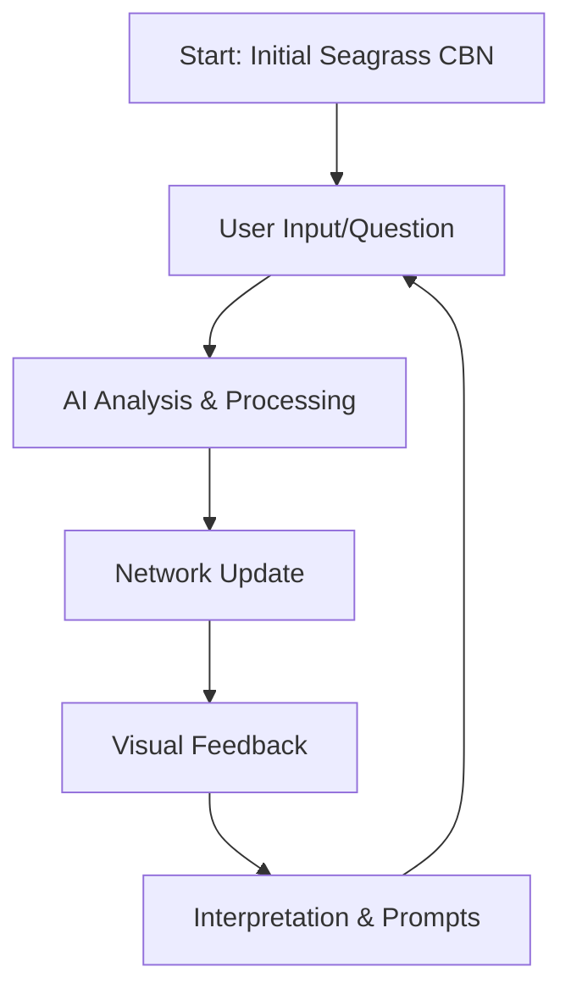

Here's a recap of our approach for the Seagrass Restoration CBN Builder:

1. Core Structure

```python
initial_cbn = {
    "nodes": [
        # Key decision & outcome variables
        {"name": "Local Support", "states": ["Weak", "Strong"]},
        {"name": "Restoration Investment", "states": ["Limited", "Adequate"]},
        {"name": "Water Quality", "states": ["Poor", "Good"]},
        {"name": "Seagrass Biomass", "states": ["Low", "Medium", "High"]},
        {"name": "Carbon Sequestration", "states": ["Low", "High"]}
    ],
    # Causal relationships showing intervention pathways
    "edges": [
        {"from": "Local Support", "to": "Restoration Investment"},
        {"from": "Restoration Investment", "to": "Water Quality"},
        {"from": "Water Quality", "to": "Seagrass Biomass"},
        {"from": "Seagrass Biomass", "to": "Carbon Sequestration"}
    ]
}
```

2. Key Features

- Interactive Visualization: Hierarchical layout showing causal flow
- Probabilistic Relationships: CPDs capturing uncertainty
- Collective Deliberation: AI-guided exploration and refinement
- Real-time Updates: Dynamic graph visualization

3. User Journey



4. Implementation Components:

```python
# Main components
def chatbot_interface(user_input, state, chat_history, chatbot):
    # Handles user interaction and network updates
    
def visualize_cbn(cbn):
    # Creates hierarchical network visualization
    
def process_user_input(cbn, user_input):
    # AI-driven analysis and network refinement
    
def interpret_cbn(cbn):
    # Generates insights about current network state
```

5. Current Focus Areas:

- Seagrass restoration decision variables
- Carbon sequestration outcomes
- Community engagement factors
- Investment and quality relationships

6. Next Steps for Enhancement:

- Add more detailed environmental variables
- Include economic factors (carbon credits)
- Expand stakeholder perspectives
- Improve visualization clarity
- Enhance collective learning features

---

- Captures Complex Interdependencies: Seagrass ecosystems involve multiple
  interacting factors (environmental, social, economic) that CBNs can naturally
  represent through directed edges
- Handles Uncertainty: The probabilistic nature of CBNs aligns well with the
  uncertainties in seagrass restoration outcomes and carbon sequestration
  estimates
- Supports Collective Learning: As stakeholders contribute knowledge, the
  network can be iteratively refined, with probabilities updated based on new
  evidence
- Enables "What-if" Analysis: Through do-calculus, stakeholders can explore
  intervention effects (e.g., "What happens to carbon sequestration if we
  improve water quality?")
